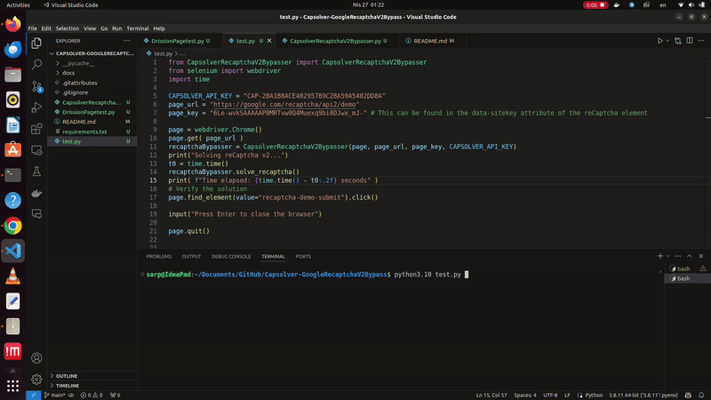

# Capsolver GoogleRecaptchaV2 Bypass
 

[](https://www.capsolver.com/?utm_source=github&utm_medium=ads&utm_campaign=scraping&utm_term=Capsolver-GoogleRecaptchaV2Bypass)

**Solve Google Recaptcha V2 in just one line of code!**

A Selenium implementation to bypass Google Recaptcha V2 using Capsolver API.

## Demo



The captcha is solved in less than 2.5 seconds.

## Installation

To install the required packages, run the following command:

```bash
pip install -r requirements.txt
```

## Usage

To use this script, you need to have a Capsolver account. You can create an account [here](https://www.capsolver.com/?utm_source=github&utm_medium=ads&utm_campaign=scraping&utm_term=Capsolver-GoogleRecaptchaV2Bypass) and get your API key. Once you have your API key, replace `YOUR_API_KEY` in the script with your actual API key.

Example usage:

```python
from CapsolverRecaptchaV2Bypasser import CapsolverRecaptchaV2Bypasser
from selenium import webdriver

CAPSOLVER_API_KEY = "CAP-YOUR_API_KEY"
page_url = "https://google.com/recaptcha/api2/demo"
page_key = "6Le-wvkSAAAAAPBMRTvw0Q4Muexq9bi0DJwx_mJ-" # This can be found in the data-sitekey attribute of the reCaptcha element

page = webdriver.Chrome()
page.get( page_url )
recaptchaBypasser = CapsolverRecaptchaV2Bypasser(page, page_url, page_key, CAPSOLVER_API_KEY)
recaptchaBypasser.solve_recaptcha()
```
## Test

To test the script, edit the `test.py` file and replace `YOUR API KEY` with your actual API key. Then run the following command:

```bash
python test.py
```

## Capsolver

Capsolver is a platform that provides APIs to solve CAPTCHAs. You can use Capsolver to bypass CAPTCHAs in your web scraping projects. The platform supports solving Google Recaptcha V2, Recaptcha V3, GeeTest, and more. You can create an account [here](https://www.capsolver.com/?utm_source=github&utm_medium=ads&utm_campaign=scraping&utm_term=Capsolver-GoogleRecaptchaV2Bypass) and get your API key.
